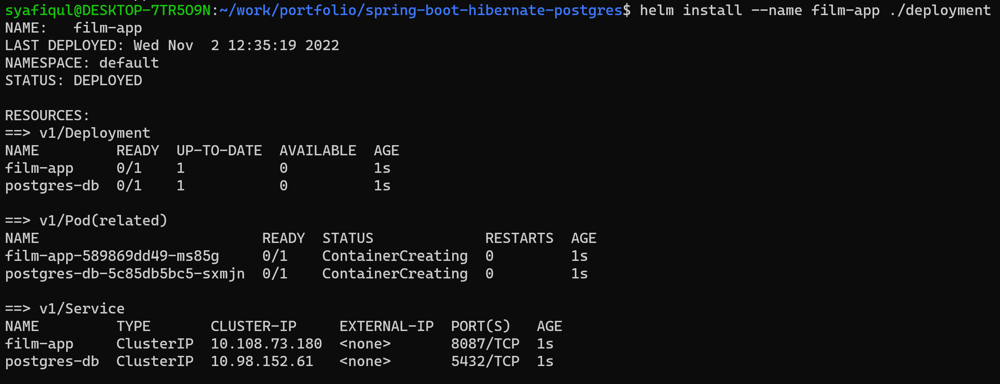
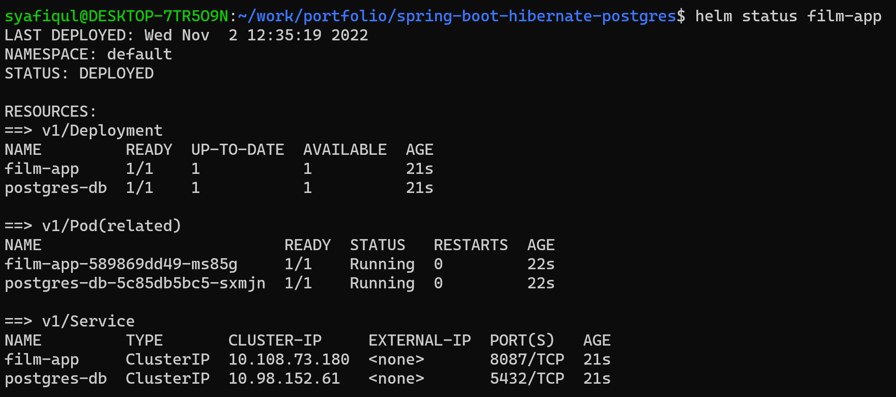
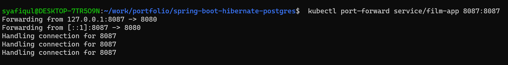
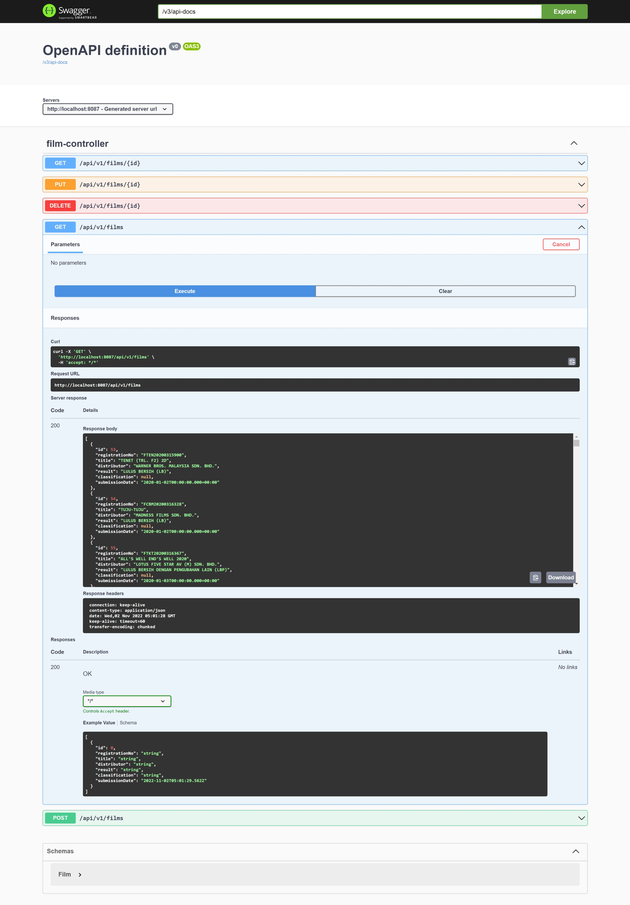

# spring-boot-hibernate-postgres
## _A personal repository on journey to become a fullstack Java developer_

This project repository is a demo of Spring Boot Web Application that demonstrates the usage of REST API.
The data used in this project is obtained from an Public Open Data Sharing Platform by Malaysian Goverment Agency MAMPU (https://www.data.gov.my/data/ms_MY/dataset)
This web application serves as a platform to search and update a list of films that have been approved by Mininstry of Home Affairs (KDN). The web application is also equipped with deployment tools to enable local Kubernetes cluster deployment via Minikube and Helm Chart. Swagger is also included in order to demonstrate the API functionalities.

## Requirements

- Linux Based OS / Windows (WSL2)
- Java JDK 8
- Spring Framework 
- Spring Boot
- Swagger UI
- PostgreSQL
- Minikube
- Helm
- Kubectl

## Running the deployment

- Using docker-compose

    ```sh
   docker-compose up -d --build
   ```


- Using Minikube via Helm Chart

  1. Build Image Locally (Kubernetes imagePullPolicy). Skip this step if the images were built previously using docker-compose.

    - Film App (Spring Boot REST API)

        ```sh
        docker build -t spring-boot-hibernate-postgres-app .
        ```

    - PostgreSQL Database (CSV data is preloaded through the init script)
    
        ```sh
        cd db
        docker build -t spring-boot-hibernate-postgres-db .
        ```
    
  2. Push the built images into Minikube

        ```sh
        minikube cache add spring-boot-hibernate-postgres-app:latest
        minikube cache add spring-boot-hibernate-postgres-db:latest
        ```
     
  3. Run Helm Chart deployment

        ```sh
        helm install --name film-app ./deployment
        ```

  4. Kubernetes port-forwarding
        ```sh
        kubectl port-forward service/film-app 8087:8087
        ```
        
## Destroying the deployments

- Using docker-compose

    ```sh
    docker-compose down
    ```
    
- Using Minikube via Helm Chart

    ```sh
    helm delete film-app --purge
    ```

## Demo

### Helm running the pods



### Helm pods status



### Kubectl port forwarding



### Kubectl port forwarding


    
    